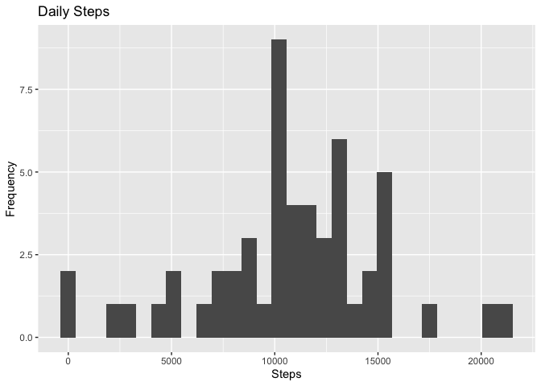
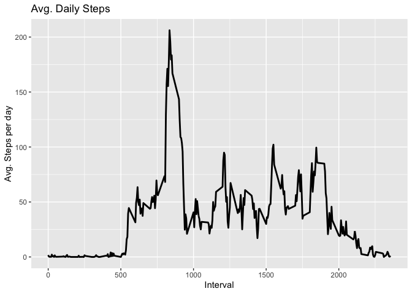
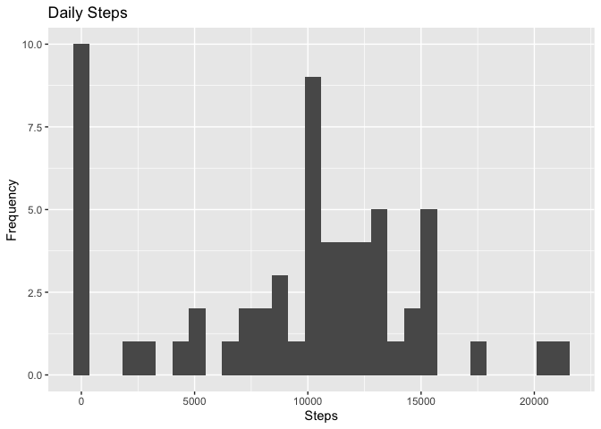
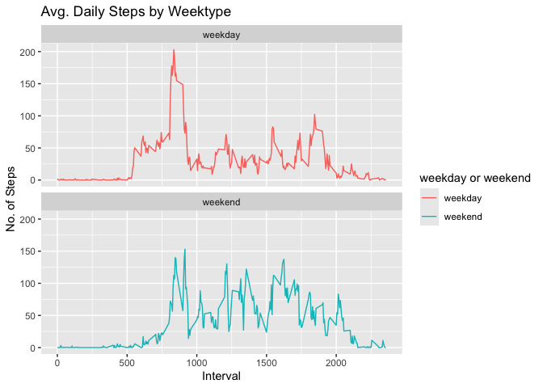

## Introduction
It is now possible to collect a large amount of data about personal movement using activity monitoring devices such as a Fitbit, Nike Fuelband, or Jawbone Up. These type of devices are part of the “quantified self” movement – a group of enthusiasts who take measurements about themselves regularly to improve their health, to find patterns in their behavior, or because they are tech geeks. But these data remain under-utilized both because the raw data are hard to obtain and there is a lack of statistical methods and software for processing and interpreting the data.

This assignment makes use of data from a personal activity monitoring device. This device collects data at 5 minute intervals through out the day. The data consists of two months of data from an anonymous individual collected during the months of October and November, 2012 and include the number of steps taken in 5 minute intervals each day.

The data for this assignment can be downloaded from the course web site:

* Dataset: [Activity monitoring data](https://d396qusza40orc.cloudfront.net/repdata%2Fdata%2Factivity.zip) 

The variables included in this dataset are:

steps: Number of steps taking in a 5-minute interval (missing values are coded as 𝙽𝙰) </br>
date: The date on which the measurement was taken in YYYY-MM-DD format </br>
interval: Identifier for the 5-minute interval in which measurement was taken </br>
The dataset is stored in a comma-separated-value (CSV) file and there are a total of 17,568 observations in this dataset. 


## Loading and preprocessing the data


```r
#install.packages("dplyr")
library(dplyr)

# Download dataset
url <- "https://d396qusza40orc.cloudfront.net/repdata%2Fdata%2Factivity.zip"
dataset <- "activity_monitoring_data"
zip_file <- paste("./", dataset, ".zip", sep="")
download.file(url, destfile = zip_file, method = "curl")

# Unzip
unzip(zip_file, exdir="./")
```


```r
# Read dataset
df <- read.csv("./activity.csv")
head(df)
```

```
##   steps       date interval
## 1    NA 2012-10-01        0
## 2    NA 2012-10-01        5
## 3    NA 2012-10-01       10
## 4    NA 2012-10-01       15
## 5    NA 2012-10-01       20
## 6    NA 2012-10-01       25
```

## What is mean total number of steps taken per day?

1. Calculate the total number of steps taken per day

```r
total_steps <- df %>% 
    group_by(date) %>% 
    summarise(steps = sum(steps, na.rm = FALSE))

head(total_steps)
```

```
## # A tibble: 6 × 2
##   date       steps
##   <chr>      <int>
## 1 2012-10-01    NA
## 2 2012-10-02   126
## 3 2012-10-03 11352
## 4 2012-10-04 12116
## 5 2012-10-05 13294
## 6 2012-10-06 15420
```
2. If you do not understand the difference between a histogram and a barplot, 
research the difference between them. Make a histogram of the total number of 
steps taken each day


```r
library(ggplot2)

ggplot(total_steps, aes(x = steps)) +
  geom_histogram(bins=30) +
  labs(title = "Daily Steps", x = "Steps", y = "Frequency")
```

<!-- -->

3. Calculate and report the mean and median of the total number of steps taken 
per day


```r
total_steps %>% summarise(Mean_Steps = mean(steps, na.rm = TRUE),
                          Median_Steps = median(steps, na.rm = TRUE))
```

```
## # A tibble: 1 × 2
##   Mean_Steps Median_Steps
##        <dbl>        <int>
## 1     10766.        10765
```

## What is the average daily activity pattern?

1. Make a time series plot (i.e. type = "l" type = "l") of the 5-minute interval
(x-axis) and the average number of steps taken, averaged across all days 
(y-axis)


```r
interval <- df %>% 
    group_by(interval) %>% 
    summarise(steps = mean(steps, na.rm = TRUE))

ggplot(interval, aes(x = interval, y = steps)) +
  geom_line(linewidth = 1) +
  labs(title = "Avg. Daily Steps", x = "Interval", y = "Avg. Steps per day")
```

<!-- -->


2. Which 5-minute interval, on average across all the days in the dataset, 
contains the maximum number of steps?


```r
interval %>% 
    filter(steps == max(steps)) %>% 
    select(max_interval = interval)
```

```
## # A tibble: 1 × 1
##   max_interval
##          <int>
## 1          835
```

## Imputing missing values

Note that there are a number of days/intervals where there are missing values 
(coded as NA). The presence of missing days may introduce bias into some 
calculations or summaries of the data.


1. Calculate and report the total number of missing values in the dataset 
(i.e. the total number of rows with NAs)


```r
df %>%
  filter(is.na(steps)) %>%
  summarise(N = n())
```

```
##      N
## 1 2304
```

2. Devise a strategy for filling in all of the missing values in the dataset. 
The strategy does not need to be sophisticated. For example, you could use the 
mean/median for that day, or the mean for that 5-minute interval, etc.

```r
df_processed <- data.frame(df)
df_processed <- df_processed %>% 
    group_by(date) %>% 
    mutate(mean_steps=ifelse(is.na(steps), 0, mean(steps, na.rm = TRUE)))

df_processed$steps[is.na(df_processed$steps)] <- df_processed$mean_steps[
    is.na(df_processed$steps)]
```


3. Create a new dataset that is equal to the original dataset but with the 
missing data filled in.

```r
write.csv(df_processed, "activity_processed.csv", row.names = FALSE)
```

4. Make a histogram of the total number of steps taken each day and Calculate 
and report the mean and median total number of steps taken per day. Do these 
values differ from the estimates from the first part of the assignment? What is 
the impact of imputing missing data on the estimates of the total daily number 
of steps?

```r
# Total number of steps taken per day
total_steps_processed <- df_processed %>% 
    group_by(date) %>% 
    summarise(steps = sum(steps))

total_steps_processed %>% 
    summarise(Mean_Steps = mean(steps), Median_Steps = median(steps))
```

```
## # A tibble: 1 × 2
##   Mean_Steps Median_Steps
##        <dbl>        <dbl>
## 1      9354.        10395
```


```r
ggplot(total_steps_processed, aes(x = steps)) +
  geom_histogram(bins=30) +
  labs(title = "Daily Steps", x = "Steps", y = "Frequency")
```

<!-- -->

## Are there differences in activity patterns between weekdays and weekends?

For this part the weekdays() function may be of some help here. Use the dataset 
with the filled-in missing values for this part.


1. Create a new factor variable in the dataset with two levels – “weekday” and 
“weekend” indicating whether a given date is a weekday or weekend day.


```r
new_df <- df %>%
  mutate(date = as.POSIXct(date, format = "%Y-%m-%d"), # Convert date to POSIXct
         `Day of Week` = weekdays(date), # Add day of the week
         `weekday or weekend` = case_when(
           grepl("Monday|Tuesday|Wednesday|Thursday|Friday", `Day of Week`) ~ "weekday",
           grepl("Saturday|Sunday", `Day of Week`) ~ "weekend"
         ), # Classify as weekday or weekend
         `weekday or weekend` = as.factor(`weekday or weekend`) # Convert to factor
         )

# Display the first 10 rows
head(new_df, 10)
```

```
##    steps       date interval Day of Week weekday or weekend
## 1     NA 2012-10-01        0      Monday            weekday
## 2     NA 2012-10-01        5      Monday            weekday
## 3     NA 2012-10-01       10      Monday            weekday
## 4     NA 2012-10-01       15      Monday            weekday
## 5     NA 2012-10-01       20      Monday            weekday
## 6     NA 2012-10-01       25      Monday            weekday
## 7     NA 2012-10-01       30      Monday            weekday
## 8     NA 2012-10-01       35      Monday            weekday
## 9     NA 2012-10-01       40      Monday            weekday
## 10    NA 2012-10-01       45      Monday            weekday
```

2. Make a panel plot containing a time series plot (i.e. type = "l") of the 
5-minute interval (x-axis) and the average number of steps taken, averaged 
across all weekday days or weekend days (y-axis). See the README file in the 
GitHub repository to see an example of what this plot should look like using 
simulated data.

```r
# Replace NA values in steps with the median of steps, removing NAs
new_df <- new_df %>% 
    mutate(steps = if_else(is.na(steps), median(steps, na.rm = TRUE), steps))

# Calculate the mean of steps by interval and weekday or weekend
new_df <- new_df %>%
  group_by(interval, `weekday or weekend`) %>%
  summarize(mean_steps = mean(steps, na.rm = TRUE)) %>%
  ungroup() # Remove the grouping
```

```
## `summarise()` has grouped output by 'interval'. You can override using the
## `.groups` argument.
```

```r
head(new_df, 10)
```

```
## # A tibble: 10 × 3
##    interval `weekday or weekend` mean_steps
##       <int> <fct>                     <dbl>
##  1        0 weekday                  2.02  
##  2        0 weekend                  0     
##  3        5 weekday                  0.4   
##  4        5 weekend                  0     
##  5       10 weekday                  0.156 
##  6       10 weekend                  0     
##  7       15 weekday                  0.178 
##  8       15 weekend                  0     
##  9       20 weekday                  0.0889
## 10       20 weekend                  0
```


```r
ggplot(new_df , aes(x = interval , y = mean_steps, color=`weekday or weekend`)) + 
    geom_line() + labs(title = "Avg. Daily Steps by Weektype", x = "Interval", 
                       y = "No. of Steps") + facet_wrap(~`weekday or weekend`, 
                                                        ncol = 1, nrow=2)
```

<!-- -->


